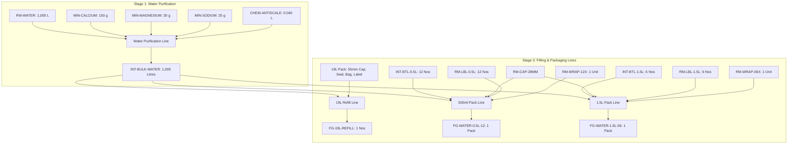

# Wateena Production Site — BOM Master Specification & Setup Handover
**Site**: `wateena` (`wateena.techxol.net`)  
**Scope**: Stage 1 (Water Purification) & Stage 3 (Filling & Packaging Lines)  
**Valuation Basis**: `Valuation Rate` (all rates initialized at `0.00`, dynamically derived from actual purchase inventory)

---

## 1. Architectural Overview & Manufacturing Stages



---

## 2. Stage 1: Water Purification BOM

### `BOM-INT-BULK-WATER-002`
- **Finished Item Produced**: `INT-BULK-WATER` (Purified Mineral Water (Bulk))
- **Base Output Quantity**: **1,000.0 Litres**
- **Rate of Materials Based On**: `Valuation Rate`
- **Is Active**: Yes (`1`) | **Is Default**: Yes (`1`)
- **Chemical Formulation Rationale**:
  - $1\text{ ppm} = 1\text{ mg/L} = 1\text{ gram per 1,000 Litres}$.
  - Calcium salt is dosed at 150 ppm (150 g per 1,000 L).
  - Magnesium salt is dosed at 30 ppm (30 g per 1,000 L).
  - Sodium salt is dosed at 25 ppm (25 g per 1,000 L).
  - Antiscalant liquid is dosed at 40 ppm (0.040 L / 40 ml per 1,000 L).
  - Raw water is modeled at 1,000 L (1:1 base, zero natural resource cost).

#### Raw Material Components Table:
| # | Item Code | Item Name | Quantity | UOM | Rate | Amount |
|:---:|---|---|:---:|:---:|:---:|:---:|
| 1 | `RM-WATER` | Raw Untreated Water | **1,000.0** | Litre | 0.00 | 0.00 |
| 2 | `MIN-CALCIUM` | Calcium Mineral Salt | **150.0** | Gram | 0.00 | 0.00 |
| 3 | `MIN-MAGNESIUM` | Magnesium Mineral Salt | **30.0** | Gram | 0.00 | 0.00 |
| 4 | `MIN-SODIUM` | Sodium Mineral Salt | **25.0** | Gram | 0.00 | 0.00 |
| 5 | `CHEM-ANTISCALE` | RO Antiscalant Liquid | **0.040** | Litre | 0.00 | 0.00 |
| | **Total Batch Cost** | | | | | **Rs 0.00** |

---

## 3. Stage 3: Finished Goods Filling & Packaging BOMs

### 1. `BOM-19L-REFILL-001` (19-Litre Commercial Bottle Refill)
- **Finished Item Produced**: `FG-19L-REFILL` (Wateena 19L Refill)
- **Base Output Quantity**: **1.0 Nos** (1 bottle)
- **Rate of Materials Based On**: `Valuation Rate`
- **Is Active**: Yes (`1`) | **Is Default**: Yes (`1`)
- **Operational Logic**: Consumes 19 Litres of bulk purified water, 1 commercial 55mm non-spill cap, and 1 tamper-evident heat shrink neck seal. The 19L polycarbonate bottle itself is tracked as a reusable asset via the `Customer Bottle Ledger`, so it is not consumed in the BOM.

#### Components Table:
| # | Item Code | Item Name | Quantity | UOM | Rate | Amount |
|:---:|---|---|:---:|:---:|:---:|:---:|
| 1 | `INT-BULK-WATER` | Purified Mineral Water (Bulk) | **19.0** | Litre | 0.00 | 0.00 |
| 2 | `RM-CAP-55MM` | 55mm Non-Spill Cap (19L) | **1.0** | Nos | 0.00 | 0.00 |
| 3 | `RM-SEAL-19L` | Heat Shrink Neck Seal - 19L | **1.0** | Nos | 0.00 | 0.00 |
| | **Total BOM Cost** | | | | | **Rs 0.00** |

---

### 2. `BOM-FG-WATER-0.5L-12-001` (500ml x 12 Pack)
- **Finished Item Produced**: `FG-WATER-0.5L-12` (Wateena Water - 500ml x 12 Pack)
- **Base Output Quantity**: **1.0 Pack** (1 shrink-wrapped pack of 12 bottles)
- **Rate of Materials Based On**: `Valuation Rate`
- **Is Active**: Yes (`1`) | **Is Default**: Yes (`1`)
- **Operational Logic**: $12 \text{ bottles} \times 0.5\text{L} = 6.0\text{ Litres}$ of purified water, packaged with 12 blown bottles, 12 caps, 12 shrink labels, and 1 shrink wrap film unit.

#### Components Table:
| # | Item Code | Item Name | Quantity | UOM | Rate | Amount |
|:---:|---|---|:---:|:---:|:---:|:---:|
| 1 | `INT-BULK-WATER` | Purified Mineral Water (Bulk) | **6.0** | Litre | 0.00 | 0.00 |
| 2 | `INT-BTL-0.5L` | Empty PET Bottle - 500ml | **12.0** | Nos | 0.00 | 0.00 |
| 3 | `RM-CAP-28MM` | 28mm Standard Plastic Cap | **12.0** | Nos | 0.00 | 0.00 |
| 4 | `RM-LBL-0.5L` | Shrink Label - 500ml | **12.0** | Nos | 0.00 | 0.00 |
| 5 | `RM-WRAP-12X` | Shrink Wrap Film (12-pack) | **1.0** | Unit | 0.00 | 0.00 |
| | **Total BOM Cost** | | | | | **Rs 0.00** |

---

### 3. `BOM-FG-WATER-1.5L-06-001` (1.5L x 6 Pack)
- **Finished Item Produced**: `FG-WATER-1.5L-06` (Wateena Water - 1.5L x 6 Pack)
- **Base Output Quantity**: **1.0 Pack** (1 shrink-wrapped pack of 6 bottles)
- **Rate of Materials Based On**: `Valuation Rate`
- **Is Active**: Yes (`1`) | **Is Default**: Yes (`1`)
- **Operational Logic**: $6 \text{ bottles} \times 1.5\text{L} = 9.0\text{ Litres}$ of purified water, packaged with 6 blown bottles, 6 caps, 6 shrink labels, and 1 shrink wrap film unit.

#### Components Table:
| # | Item Code | Item Name | Quantity | UOM | Rate | Amount |
|:---:|---|---|:---:|:---:|:---:|:---:|
| 1 | `INT-BULK-WATER` | Purified Mineral Water (Bulk) | **9.0** | Litre | 0.00 | 0.00 |
| 2 | `INT-BTL-1.5L` | Empty PET Bottle - 1.5L | **6.0** | Nos | 0.00 | 0.00 |
| 3 | `RM-CAP-28MM` | 28mm Standard Plastic Cap | **6.0** | Nos | 0.00 | 0.00 |
| 4 | `RM-LBL-1.5L` | Shrink Label - 1.5L | **6.0** | Nos | 0.00 | 0.00 |
| 5 | `RM-WRAP-06X` | Shrink Wrap Film (6-pack) | **1.0** | Unit | 0.00 | 0.00 |
| | **Total BOM Cost** | | | | | **Rs 0.00** |

---

## 4. Automated Python Provisioning Script for Production Server

Save this script as `setup_wateena_boms.py` or run directly from the installed `lean_production` app:
```bash
bench --site wateena execute lean_production.setup_wateena_boms.run
```

```python
import frappe

def run():
    print("Starting Wateena Stage 1 & Stage 3 BOM configuration...")

    boms_config = [
        # --- Stage 1: Water Purification ---
        {
            "item": "INT-BULK-WATER",
            "quantity": 1000.0,
            "uom": "Litre",
            "items": [
                {"item_code": "RM-WATER", "qty": 1000.0, "uom": "Litre"},
                {"item_code": "MIN-CALCIUM", "qty": 150.0, "uom": "Gram"},
                {"item_code": "MIN-MAGNESIUM", "qty": 30.0, "uom": "Gram"},
                {"item_code": "MIN-SODIUM", "qty": 25.0, "uom": "Gram"},
                {"item_code": "CHEM-ANTISCALE", "qty": 0.040, "uom": "Litre"},
            ]
        },
        # --- Stage 3: Finished Goods Filling Lines ---
        {
            "item": "FG-19L-REFILL",
            "quantity": 1.0,
            "uom": "Nos",
            "items": [
                {"item_code": "INT-BULK-WATER", "qty": 19.0, "uom": "Litre"},
                {"item_code": "RM-CAP-55MM", "qty": 1.0, "uom": "Nos"},
                {"item_code": "RM-SEAL-19L", "qty": 1.0, "uom": "Nos"},
            ]
        },
        {
            "item": "FG-WATER-0.5L-12",
            "quantity": 1.0,
            "uom": "Pack",
            "items": [
                {"item_code": "INT-BULK-WATER", "qty": 6.0, "uom": "Litre"},
                {"item_code": "INT-BTL-0.5L", "qty": 12.0, "uom": "Nos"},
                {"item_code": "RM-CAP-28MM", "qty": 12.0, "uom": "Nos"},
                {"item_code": "RM-LBL-0.5L", "qty": 12.0, "uom": "Nos"},
                {"item_code": "RM-WRAP-12X", "qty": 1.0, "uom": "Unit"},
            ]
        },
        {
            "item": "FG-WATER-1.5L-06",
            "quantity": 1.0,
            "uom": "Pack",
            "items": [
                {"item_code": "INT-BULK-WATER", "qty": 9.0, "uom": "Litre"},
                {"item_code": "INT-BTL-1.5L", "qty": 6.0, "uom": "Nos"},
                {"item_code": "RM-CAP-28MM", "qty": 6.0, "uom": "Nos"},
                {"item_code": "RM-LBL-1.5L", "qty": 6.0, "uom": "Nos"},
                {"item_code": "RM-WRAP-06X", "qty": 1.0, "uom": "Unit"},
            ]
        }
    ]

    for cfg in boms_config:
        item_code = cfg["item"]

        # Check existing active BOMs
        existing_boms = frappe.get_all("BOM", filters={"item": item_code, "docstatus": 1})
        is_up_to_date = False

        if existing_boms:
            for eb in existing_boms:
                bdoc = frappe.get_doc("BOM", eb.name)
                # Check if components match
                current_items = {d.item_code: (round(float(d.qty), 4), d.uom) for d in bdoc.items}
                target_items = {c["item_code"]: (round(float(c["qty"]), 4), c["uom"]) for c in cfg["items"]}

                if current_items == target_items and round(float(bdoc.quantity), 4) == round(float(cfg["quantity"]), 4):
                    is_up_to_date = True
                    frappe.db.set_value("BOM", bdoc.name, {"is_default": 1, "is_active": 1})
                    frappe.db.set_value("Item", item_code, "default_bom", bdoc.name)
                    print(f"BOM {bdoc.name} for {item_code} is already up to date.")
                else:
                    # Cancel and delete outdated BOM cleanly (no transactions exist)
                    print(f"BOM {bdoc.name} for {item_code} is outdated. Cancelling and deleting...")
                    if bdoc.docstatus == 1:
                        bdoc.cancel()
                    frappe.delete_doc("BOM", bdoc.name, force=True)

        if is_up_to_date:
            continue

        # Create clean canonical BOM
        doc = frappe.new_doc("BOM")
        doc.item = item_code
        doc.quantity = cfg["quantity"]
        doc.uom = cfg["uom"]
        doc.is_active = 1
        doc.is_default = 1
        doc.with_operations = 0
        doc.rm_cost_as_per = "Valuation Rate"

        for comp in cfg["items"]:
            comp_doc = frappe.get_doc("Item", comp["item_code"])
            doc.append("items", {
                "item_code": comp["item_code"],
                "qty": comp["qty"],
                "uom": comp["uom"],
                "stock_uom": comp_doc.stock_uom,
                "rate": 0.0,
                "amount": 0.0
            })

        doc.insert(ignore_permissions=True)
        doc.submit()

        # Set as default on Item Master
        frappe.db.set_value("Item", item_code, "default_bom", doc.name)
        print(f"Created and activated clean BOM {doc.name} for {item_code}")

    # Ensure all rates in BOMs are clean 0.00 until purchases are booked
    frappe.db.sql("UPDATE `tabBOM Item` SET rate=0.0, amount=0.0, base_rate=0.0, base_amount=0.0")
    frappe.db.sql("UPDATE `tabBOM` SET raw_material_cost=0.0, total_cost=0.0, base_raw_material_cost=0.0, base_total_cost=0.0, rm_cost_as_per='Valuation Rate'")

    frappe.db.commit()
    print("Stage 1 & Stage 3 BOMs successfully configured on Wateena production!")
```
